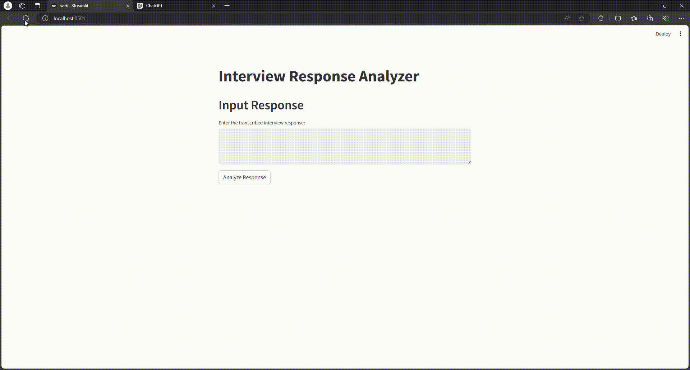

# Interview Response Analysis App

This application analyzes interview responses for sentiment, key phrases, and overall quality. It uses various NLP techniques and models to assess the relevance and sentiment of the responses.



## Features
- **Sentiment Analysis**: Determines the sentiment polarity of the response.
- **Key Phrase Extraction**: Extracts key phrases while filtering out stopwords.
- **Fuzzy Matching**: Performs fuzzy matching between extracted key phrases and a list of expected key phrases to assess relevance.
- **Overall Quality Assessment**: Provides an overall quality assessment based on sentiment, relevance, and domain-specific criteria.

## app.py

### Overview
`app.py` is the main application file that performs the core functionality of the Interview Response Analysis. It integrates several NLP tools and libraries to process and analyze text data.

### Key Components
1. **Sentiment Analysis**:
    - Uses `TextBlob` to analyze the sentiment of the input text.
    - Classifies the sentiment as Positive, Neutral, or Negative based on the polarity score.

2. **Key Phrase Extraction**:
    - Leverages `spaCy` to identify and extract key phrases from the text.
    - Filters out common stopwords to focus on meaningful phrases.

3. **Fuzzy Matching**:
    - Employs `fuzzywuzzy` to compare extracted key phrases with a predefined list of expected key phrases.
    - Matches phrases based on a similarity ratio, enhancing the relevance assessment.

4. **Overall Quality Assessment**:
    - Combines sentiment analysis and fuzzy matching results to provide an overall quality score.
    - Considers domain-specific criteria to adjust the final quality rating.

### Usage
1. **Input**: There is a list of statements defined in the program.
2. **Analysis**: Clicking the "Analyze Response" button triggers the analysis process.
3. **Output**: The app displays the sentiment, extracted key phrases, matched key phrases, and overall quality of the response.

### Example
Here's a sample of how to run the app locally:

1. Clone this repository:
    ```bash
    git clone https://github.com/shivanshtri010/Interview-Response-Analysis.git
    cd Interview-Response-Analysis
    ```
2. Install the required packages:
    ```bash
    pip install -r requirements.txt
    ```
3. Run the Streamlit app:
    ```bash
    python -u "./app.py"
    ```

## web.py

`web.py` is a simplified version of the application that demonstrates core functionalities of the above program in web. It is designed for environments where simplicity and ease of deployment are priorities.

### Key Components
1. **Sentiment Analysis**:
    - Uses `TextBlob` for a quick sentiment polarity check.

2. **Key Phrase Extraction**:
    - Also utilizes `spaCy` for extracting key phrases and filtering stopwords.

3. **Fuzzy Matching**:
    - Implements the same fuzzy matching logic as in `app.py` to assess relevance.

4. **Overall Quality Assessment**:
    - Follows the same methodology to combine sentiment and relevance for quality scoring.

### Example
To run `web.py`, follow similar steps as for `app.py`, ensuring all dependencies are installed as listed in `requirements.txt`.

## Requirements

### Prerequisites
- Python 3.6 or higher

### Installation
Install the required Python packages:
```bash
pip install -r requirements.txt
